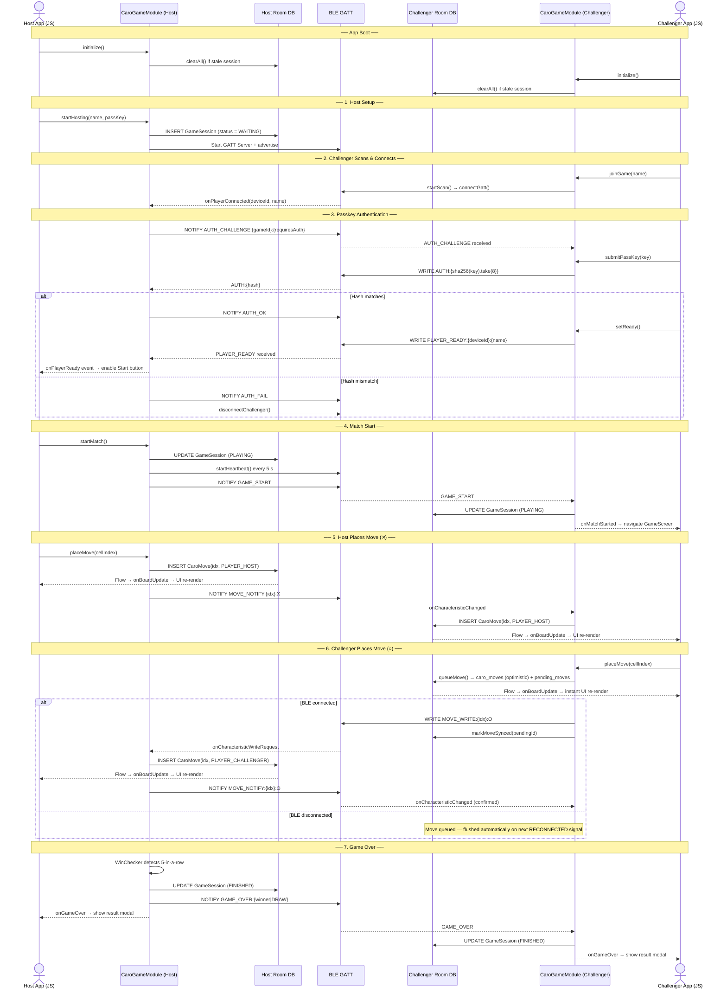
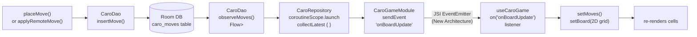
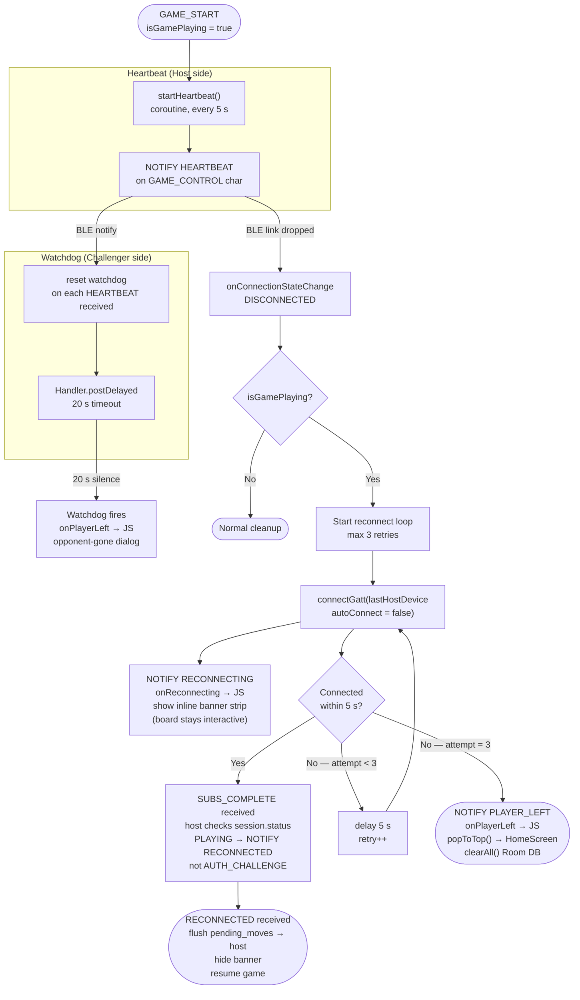

# Caro BLE — Bluetooth Multiplayer Gomoku

A React Native **Gomoku (Caro)** game that uses **Bluetooth Low Energy (BLE)** for real-time peer-to-peer multiplayer — no internet or server required. Built with a custom native Android **TurboModule**, Room database, and a BLE GATT server/client.

---

## Features

- **15×15 Gomoku board** with 5-in-a-row win detection
- **Real-time BLE multiplayer** — Host advertises, Challenger auto-connects (no internet required)
- **Persistent game state** via Room (SQLite) — survives app backgrounding and navigation
- **Foreground BLE service** keeps connection alive while app is minimised
- **Synchronization fixes:**
  - Game state is re-hydrated on navigation (mount-sync)
  - Boolean serialization properly typed in Kotlin responses
  - BLE GATT operations queue ensures reliable descriptor writes
  - Reconnect routing fixed: `SUBS_COMPLETE` routes to `RECONNECTED` (not `AUTH_CHALLENGE`) when a game is already `PLAYING`
  - Board-wipe-on-reconnect prevented: `AUTH_CHALLENGE` handler guards against clearing an in-progress game
- **Offline move queue** — Challenger moves are written to `pending_moves` (Room DB v2) immediately; flushed to host on reconnect; board remains playable during disconnection
- **Non-blocking reconnect UX** — Inline banner strip replaces full-screen modal; board stays interactive during reconnect; manual **Reconnect** and **Forfeit** buttons available in gameplay
- Winning-cells highlight animation and draw detection
- **Comprehensive test coverage:** 44 Jest tests + Kotlin unit tests

---

## Tech Stack

| Layer | Technology |
|---|---|
| UI | React Native (TypeScript) |
| Navigation | React Navigation v7 |
| Native module | Kotlin TurboModule (`CaroGameModule`) |
| BLE | Android GATT Server/Client (`BluetoothLeAdvertiser`, `BluetoothLeScanner`) |
| Persistence | Room (SQLite) via `CaroDatabase` |
| Serialisation | Kotlin Serialization (JSON) |
| Testing | Jest + @testing-library/react-native, JUnit 4 + kotlinx-coroutines-test |

---

## Architecture & Data Flow

### 1. System Architecture

```mermaid
flowchart LR
    subgraph HostPhone["📱  Phone A  —  HOST"]
        direction TB
        HUI["HomeScreen\nLobbyScreen\nGameScreen"]
        HHook["useCaroGame Hook\n(React state + events)"]
        HCGM["CaroGameModule\n(Kotlin TurboModule)"]
        HRepo["CaroRepository"]
        HDB[("Room DB\ntable: caro_moves\ntable: game_sessions")]
        HBle["CaroBleService\n(foreground service)"]
        GSRV["GATT Server\nadvertising"]
    end

    subgraph BLEChannel["  🔵  BLE GATT Channel  "]
        direction TB
        C1["① MOVE_NOTIFY\nhost → challenger  (notify)"]
        C2["② MOVE_WRITE\nchallenger → host  (write)"]
        C3["③ FULL_SYNC_READ\nboard snapshot  (read)"]
        C4["④ GAME_CONTROL\ncontrol protocol  (notify + write)"]
    end

    subgraph ChallengerPhone["📱  Phone B  —  CHALLENGER"]
        direction TB
        GCLI["GATT Client\n(scan + connect)"]
        CBle["CaroBleService\n(foreground service)"]
        CCGM["CaroGameModule\n(Kotlin TurboModule)"]
        CRepo["CaroRepository"]
        CDB[("Room DB\ntable: caro_moves\ntable: game_sessions\ntable: pending_moves")]
        CHook["useCaroGame Hook\n(React state + events)"]
        CUI["LobbyScreen\nGameScreen"]
    end

    HUI <--"JSI (New Arch)"--> HHook
    HHook <--"JSI"--> HCGM
    HCGM <--> HRepo <--> HDB
    HDB -. "Flow → onBoardUpdate\n(observer pipeline)" .-> HHook
    HCGM --> HBle --> GSRV
    GSRV <--"BLE radio"--> BLEChannel
    BLEChannel <--"BLE radio"--> GCLI
    GCLI --> CBle --> CCGM
    CCGM <--> CRepo <--> CDB
    CDB -. "Flow → onBoardUpdate\n(observer pipeline)" .-> CHook
    CCGM <--"JSI"--> CHook <--> CUI
```



---

### 2. Game Session Lifecycle



---

### 3. Room DB Observer Pipeline

Both phones keep their Room DB in sync independently. The same observer pipeline runs on each device.



---

### 4. Heartbeat, Watchdog & Reconnect



---

## Critical Fixes Applied

This implementation resolves three core issues that prevented reliable multiplayer gameplay:

### 1. Boolean Serialization
**Problem:** Native `placeMove()` returned booleans as strings (`"false"` is truthy in JS). Game incorrectly showed WIN/FINISHED immediately.  
**Solution:** Created `@Serializable` Kotlin data classes (`PlaceMoveResponse`, `GameStateResponse`) with proper boolean types, not string coercion.

### 2. BLE Descriptor Write Sequencing  
**Problem:** Android 13+ allows only one pending GATT operation at a time. Multiple simultaneous CCCD writes failed silently, causing Challenger to miss move notifications.  
**Solution:** Implemented operation queue (`pendingGattOps`, `enqueueGattOp()`, `drainGattQueue()`) that chains GATT operations with callbacks.

### 3. Game State Lost on Navigation
**Problem:** `useCaroGame()` creates fresh local state per component instance. Navigating away and back to GameScreen reset game to WAITING despite native module having active game.  
**Solution:** Added mount-sync `useEffect` that calls `getGameState()` + `getBoard()` on mount, re-hydrating React state from native.

### 4. Board Permanently Blocked After Reconnect
**Problem:** `MSG_RECONNECTED` constant existed but was never emitted. Auto-reconnect triggered `SUBS_COMPLETE` → host always replied with `AUTH_CHALLENGE` → `isReconnecting` stayed `true` → board was permanently disabled for the challenger.  
**Solution:** `MSG_SUBS_COMPLETE` handler now checks `session.status == "PLAYING"`. When `PLAYING`, host sends `MSG_RECONNECTED` instead of `AUTH_CHALLENGE`, unblocking the board.

### 5. Board Wiped on Reconnect
**Problem:** `AUTH_CHALLENGE` handler called `repo.clearAll()` unconditionally — in-progress board state destroyed on every reconnect attempt.  
**Solution:** Guard inside `moduleScope.launch`: `if (session?.status == "PLAYING" && challengeGameId == gameId) return@launch` — skips `clearAll()` when a game is already `PLAYING`.

### 6. Offline Moves Lost on Disconnect
**Problem:** Challenger's `placeMove` sent moves via BLE only. If the connection dropped mid-turn, the move was silently discarded.  
**Solution:** `queueMove()` writes to both `caro_moves` (instant UI via Room observer) and `pending_moves` (persistent queue). `MSG_RECONNECTED` handler flushes all unsynced pending moves to the host in order.

---

## Getting Started

### Prerequisites

- Node.js ≥ 18, Java 17, Android SDK (API 26+)
- React Native environment set up — see the [official guide](https://reactnative.dev/docs/set-up-your-environment)

### Install dependencies

```sh
npm install
```

### Start Metro

```sh
npm start
```

### Run on Android (emulator or device)

```sh
npm run android
```

> **Note:** BLE advertising does not work on emulators. Use a real Android device to test multiplayer. See the [Real Device](#running-on-a-real-android-device) section below.

---

## Project Structure

```
src/
  components/
    game/        # GameBoard, GameHUD, GameOverModal
    ui/          # Button, Card, Badge
  hooks/
    useCaroGame.ts       # All game state & native bridge calls
  navigation/
    AppNavigator.tsx     # Stack navigator
  screens/
    HomeScreen.tsx       # Main menu
    LobbyScreen.tsx      # BLE host/join lobby
    GameScreen.tsx       # Active game board
    HowToPlayScreen.tsx  # Rules
  specs/
    NativeCaroGame.ts    # TurboModule TypeScript spec
  theme/
    index.ts             # Colors, spacing, typography

android/app/src/main/java/com/reactnativeroom/
  turbo/          # CaroGameModule (TurboModule), CaroGamePackage
  service/        # CaroBleService (GATT server + client), BleConstants
  repository/     # CaroRepository, MoveResult
  database/       # Room: CaroDatabase (v2), CaroDao, CaroMove, GameSession, PendingMove, PendingMoveDao
  game/           # WinChecker
```

---

## How to Play

1. **Host Game** (Device A):
   - Tap "Host Game" on the Home screen
   - Advertises via BLE and waits in LobbyScreen
   - Shows the Game ID and waits for challenger

2. **Join Game** (Device B):
   - Tap "Join Game" on the Home screen
   - Auto-scans for nearby hosts
   - Auto-connects as "Challenger" once a host is found
   - Shows in Device A's player list

3. **Start Match**:
   - Device A taps "Start Match" once Device B connects
   - Both devices navigate to the game board
   - **X** (host) goes first, **O** (challenger) goes second

4. **Play**:
   - Players alternate placing marks
   - First to place **5 in a row** (horizontal, vertical, or diagonal) wins
   - The app displays a win/loss/draw modal at game end

---

## Running on a Real Android Device

> **Important:** The multiplayer Bluetooth (BLE) features **require a real Android device**. They will not work on emulators or the iOS Simulator because those environments do not support BLE advertising.

### Prerequisites

- Android device running **Android 8.0 (API 26) or later**
- Two Android devices to test full multiplayer (one host, one joiner)
- USB cable or Wi-Fi ADB

### Step 1 — Enable Developer Options on your phone

1. Open **Settings → About phone**
2. Tap **Build number** 7 times until you see "You are now a developer!"
3. Go back to **Settings → Developer options**
4. Turn on **USB debugging**

### Step 2 — Connect your device

**Via USB:**
```sh
# Plug in the USB cable, then verify device is detected
adb devices
```
You should see your device listed as `device` (not `unauthorized`). If it says `unauthorized`, unlock your phone and tap **Allow** on the USB debugging prompt.

**Via Wi-Fi (Android 11+):**
1. In Developer options, tap **Wireless debugging → Pair device with QR code** (or use the 6-digit code)
2. Then run:
```sh
adb pair <ip>:<port>   # from the pairing dialog
adb connect <ip>:<port>  # use the connection port shown
adb devices  # confirm device appears
```

### Step 3 — Grant Bluetooth permissions on first launch

On **Android 12+**, the app requests these runtime permissions on first launch:
- `BLUETOOTH_SCAN`
- `BLUETOOTH_CONNECT`
- `BLUETOOTH_ADVERTISE`

Tap **Allow** for each prompt. If you accidentally denied them, go to **Settings → Apps → ReactNativeRoom → Permissions → Nearby devices** and enable them manually.

### Step 4 — Build and run on the device

Make sure Metro is running (`npm start`), then in a second terminal:

```sh
# Build debug APK and deploy to connected device
npm run android

# Build release
npx react-native run-android --mode release

# OR target a specific device if you have multiple connected
npx react-native run-android --deviceId <device-serial>
```

To get your device serial:
```sh
adb devices
```

### Step 5 — Test multiplayer BLE flow

1. **Device A (Host):** Tap **Host Game** — the lobby starts advertising via BLE and displays a Game ID
2. **Device B (Joiner):** Tap **Join Game** — scans for nearby hosts and connects automatically
3. Once Device B shows as **Challenger** in Device A's lobby, tap **Start Match** on Device A
4. Both devices navigate to the game board — Device A plays as **X**, Device B as **O**

> **Tip:** Keep both devices within ~10 metres of each other with Bluetooth enabled for reliable BLE connectivity.

### Installing a signed APK directly

If you want to share the app without a cable:

```sh
# Build a debug APK
cd android && ./gradlew assembleDebug

# APK location:
# android/app/build/outputs/apk/debug/app-debug.apk

# Install via ADB
adb install android/app/build/outputs/apk/debug/app-debug.apk
```

---

## Testing

### Run Jest tests (React Native + Hooks)
```sh
npm test
# or for specific suite:
npm test -- __tests__/hooks/useCaroGame.test.ts
```

### Run Kotlin unit tests
```sh
cd android && ./gradlew test
```

**Test coverage:**
- **Hook tests** (18): Game state, move validation, board derivation, win detection
- **Integration tests** (5): Full game flow from host → join → match → win
- **Component tests** (20): GameBoard, GameHUD, GameOverModal rendering and interaction
- **Kotlin tests** (8): WinChecker edge cases (horizontal, vertical, diagonal wins)

**Key test scenarios:**
- ✅ Game starts in WAITING, transitions to PLAYING on match start
- ✅ Board state syncs from native on mount (fixes WAITING on navigation)
- ✅ Move placement updates 2D grid correctly
- ✅ Boolean parsing handles both `true` and `"true"` (safety net for native bridge)
- ✅ 5-in-a-row detection works in all directions
- ✅ Draw detection on full board
- ✅ Game reset clears all state

---

## Troubleshooting

| Problem | Fix |
|---|---|
| `adb devices` shows `unauthorized` | Unlock phone, tap **Allow** on the USB debugging dialog |
| App crashes on "Host Game" | Ensure Bluetooth is enabled and all Nearby Device permissions are granted |
| "Host Game" shows Bluetooth Unavailable | You are on an emulator — use a real physical device |
| Game stuck in WAITING on navigation | App auto-syncs game state on mount; if issue persists, go back and re-enter screen |
| Challenger can't move after host's first move | Fixed: `SUBS_COMPLETE` now checks game status before sending `AUTH_CHALLENGE` — reconnect routes to `RECONNECTED` instead |
| Board clears on reconnect | Fixed: `AUTH_CHALLENGE` handler guards against wiping an in-progress game |
| Move lost after disconnect | Fixed: Moves are queued in `pending_moves` DB and synced automatically on reconnect |
| Devices don't discover each other | Keep within ~10 m; restart Bluetooth on both; ensure no other app uses the same BLE service UUID |
| Build fails with Kotlin error | Run `cd android && ./gradlew clean` then retry `npm run android` |
| Metro bundler not found | Run `npm start` in the project root before running the Android command |

---

## Development Tips

**Reload the app:**
- **Android:** Press <kbd>R</kbd> twice, or <kbd>Cmd ⌘</kbd> + <kbd>M</kbd> → Reload
- **iOS Simulator:** Press <kbd>R</kbd>

**View native logs:**
```sh
adb logcat -s CaroBleService CaroGameModule ReactNativeJS
```

**Clean build:**
```sh
cd android && ./gradlew clean && cd .. && npm run android
```
